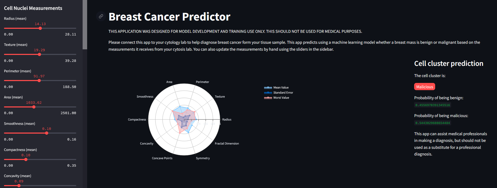

# Breast Cancer Predictor

This project is a machine learning application that predicts whether a breast mass is benign or malignant based on cytological features. The application consists of a data processing and model training script (`main.py`), and a frontend web application built with Streamlit.

## Features

- Data cleaning and preprocessing
- Logistic Regression model for classification
- Scaled features for better model performance
- Interactive web interface for inputting cell nuclei measurements
- Radar chart visualization of the input features
- Prediction of cell cluster as benign or malignant

## Getting Started

### Prerequisites

- Python 3.6+
- Required Python packages: `pandas`, `scikit-learn`, `pickle`, `streamlit`, `plotly`, `numpy`

### Installation

1. Clone the repository:
    ```bash
    git clone https://github.com/yourusername/breast-cancer-predictor.git
    cd breast-cancer-predictor
    ```

2. Install the required packages:
    ```bash
    pip install -r requirements.txt
    ```

3. Download the dataset and place it in the `data` folder:
    - The dataset should be named `cancer-data.csv` and should be in the `data` directory.

### Usage

1. Run the data processing and model training script:
    ```bash
    python main.py
    ```

   This script will:
   - Load and clean the data
   - Train a logistic regression model
   - Save the trained model and scaler to the `src` directory

2. Run the Streamlit web application:
    ```bash
    streamlit run app.py
    ```

   This will start the web application. Open your web browser and navigate to `http://localhost:8501` to interact with the app.

### Directory Structure

- `data/`: Directory for the dataset.
- `src/`: Directory for the saved model and scaler.
- `assets/`: Directory for additional assets such as stylesheets.
- `main.py`: Script for data processing and model training.
- `app.py`: Streamlit web application script.

### Data Cleaning and Model Training (`main.py`)

The `main.py` script performs the following steps:

1. **Data Cleaning**: 
   - Removes unnecessary columns (`Unnamed: 32` and `id`)
   - Maps diagnosis labels from 'M' (Malignant) and 'B' (Benign) to 1 and 0, respectively.

2. **Model Training**:
   - Scales the feature values using `StandardScaler`
   - Splits the data into training and testing sets
   - Trains a logistic regression model
   - Evaluates the model and prints the accuracy and classification report
   - Saves the trained model and scaler using `pickle`

### Streamlit Web Application (`app.py`)

The `app.py` script provides an interactive web interface for the breast cancer predictor:

- **Sidebar**: 
  - Sliders for inputting cell nuclei measurements
- **Main Panel**: 
  - Title and description
  - Radar chart visualization of the input features
  - Prediction of whether the cell cluster is benign or malignant
  - Display of prediction probabilities

## Disclaimer

THIS APPLICATION WAS DESIGNED FOR MODEL DEVELOPMENT AND TRAINING USE ONLY. THIS SHOULD NOT BE USED FOR MEDICAL PURPOSES. This app can assist medical professionals in making a diagnosis but should not be used as a substitute for a professional diagnosis.

## Contributing

Contributions are welcome! Please fork the repository and submit a pull request with your changes.

## License

This project is licensed under the MIT License.
